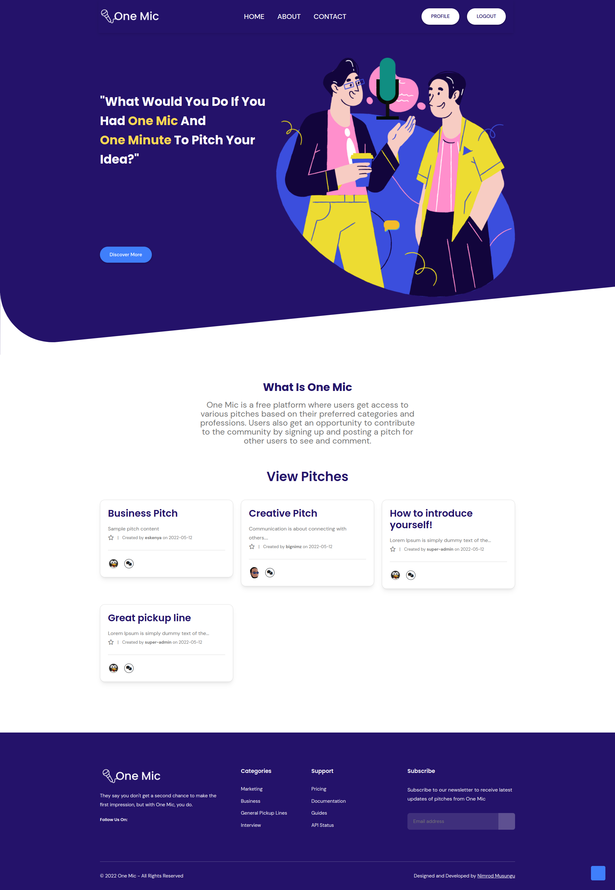
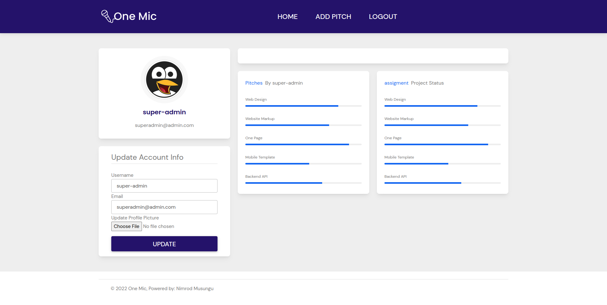

# One Mic

One Mic is a web application built upon python and flask framework and runs on a postgresql database. The application allows users to create account and start writing or commenting on pitches created by others.


## Landing Page



## Profile Page



## Technologies Implemented in this Project

1. Python 3.8
2. Flask-SQLAlchemy
3. PostgreSQL
4. Html5
5. Bootstrap5
6. JavaScript
7. Custom CSS
8. MarkDown

## User Story

1. Users can see the pitches other people have posted.

2. Users can svote on the pitch they liked and give it a downvote or upvote.

3. Users can sign in to leave a comment.

4. Users can register on the website.

5. Users can receive a welcoming email once they sign up.

6. Users can view the pitches they have created in their profile page..

7. Users can comment on the different pitches and leave feedback.

8. Users can submit a pitch in any category.

9. Users can view the different categories.


### Project Setup & Instructions

```python
1. git clone the repository: git@github.com:bignimz/one-mic-pitches.git

2. cd into one-mic-pitches

3. $ python3.8 -m venv --without-pip virtual

4. $ source virtual/bin/activate

5. Open CMD & Install Dependancies: pip install -r requirements.txt

6. Run the application in your virtual environment: python run.py
```


## Project Author

Name: Nimrod Musungu <br>
Email: nimrod.chitayi@gmail.com<br>
Website: nimrodmusungu.com


## Known Bugs

There are no known bugs currently but pull requests are allowed incase you spot a bug


## Contribution

Pull requests are welcome. For major changes, please open an issue first to discuss what you would like to change.

Please make sure to update tests as appropriate.

## License

[MIT](https://choosealicense.com/licenses/mit/)

